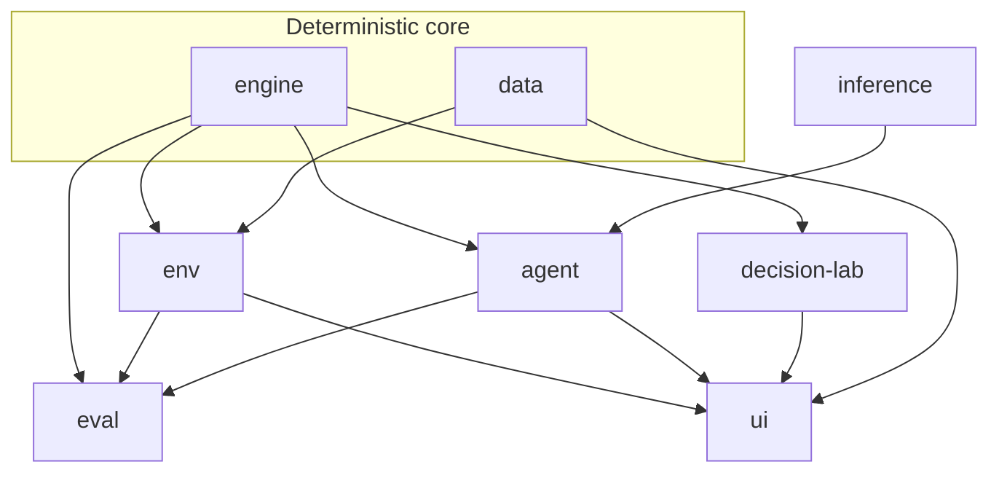

# AGENT ARENA

[](https://github.com/Settar-Mengli/robot-agent-arena/actions/workflows/ci.yml)
[MIT license](LICENSE)

**An agent evaluation framework that measures and diagnoses decision quality against an exact oracle.** The robot battle is the **reference environment** — not the product.

Configure agent design choices. Run them in a seeded, pure TypeScript environment. See which decisions were suboptimal, by how much, and why — cited to exact best-response ground truth.

**Try it:** [Live demo (GitHub Pages)](https://settar-mengli.github.io/robot-agent-arena/) — start with **Beat the AI** (recorded Challenge). Live AI is **optional BYOK** (your OpenRouter key) and is **never ranked** evidence.

---

## Key findings (scoped)

- **D-030 / D-024 (historical):** On the **pre-dedupe** held-out adversarial suite, grounding changed **0** decisions — D-024 falsified. The published **0/20** figure is **narrative-only** (pre–[D-035](DECISIONS.md) duplicate states). See [EVAL.md — Ablation](EVAL.md#ablation-m-tools) and [Findings](EVAL.md#findings).
- **D-035:** Committed held-out adversarial measurement set is **n=13** distinct states (not 20). Greedy baseline on that suite: **0%** optimal / mean regret **156.15**. Snapshot optimality at this n has **no confidence interval**. See [EVAL.md](EVAL.md#ablation-m-tools) and `evals/out-committed/adversarial.baselines.json`.
- **D-044:** Heldout-ext **n=35** meets the evidence gate (Wilson width &lt; 0.40 and n≥30). See [EVAL.md](EVAL.md) bench tables and `evals/out-committed/adversarial.heldout-ext.baselines.json`.
- **D-051 (Batch 4):** On heldout-ext **n=35**, two models — rewording, a fixed rumor, and partial facts did **not** produce separable Δregret vs base. Gemini **0/35** flips on new arms; Groq **1/35** (same snapshot as base-repeat noise). See [EVAL.md — Batch 4](EVAL.md#batch-4-d-051-robustness-heldout-ext-n35), `docs/preregistration-batch4.md`, `evals/out-committed/batch4.robustness.summary.json`.
- **D-052 (Batch 5):** Second reference environment (**Resonance Seal**) proves `EnvironmentOf` generality. Committed greedy/random baselines **n=40** (Seal regret scale ≠ robot battle — never compare across envs). See [EVAL.md — Batch 5](EVAL.md#batch-5-d-052-resonance-seal-second-reference-environment), `evals/out-committed/resonance-seal.baselines.v1.json`.

---

## What it is / what it is not

| It is | It is not |
|-------|-----------|
| A **measurement and diagnosis** harness with an exact oracle | A casual robot-fighting game as the end goal |
| A **reference environment** on a shared `EnvironmentOf` interface (robot + Resonance Seal) | A public model leaderboard that ranks live chatbots |
| Committed fixture **replay** in CI; optional BYOK live play | Live BYOK answers as published evidence |
| Fictional vocabulary and security-themed lore | Real attack, jailbreak, or prompt-injection content |

Identity, memory, tools/skills, guardrails/rules, and strategy are the design surface. Binding honesty: every public conclusion must trace to a measurement ([D-020](DECISIONS.md) / [D-031](DECISIONS.md) / [D-033](DECISIONS.md)). Temporary product title: **AGENT ARENA**. Repository: `robot-agent-arena`.

---

## How evaluation works

- **Oracle:** exact best CPU response **vs a fixed player policy** — not a Nash equilibrium ([D-037](DECISIONS.md)).
- **Regret:** gap between the chosen action’s value and the oracle-best value on that state.
- **Wilson 95% intervals** on rates; **insufficient-evidence** gate when n is too small or intervals too wide (see [EVAL.md](EVAL.md)).
- **CI:** keyless `eval:replay` against committed fixtures (no API keys in Actions).

Depth, tables, and protocols: **[EVAL.md](EVAL.md)**.

---

## Architecture



**Import fences (ESLint `no-restricted-imports` in `eslint.config.js`):** `ui`, `env`, and `agent` must not import `eval`. `engine` must not import `agent` / `inference` / `eval` / React. `decision-lab` must not import `eval` / React / Node fs. Resonance Seal stays pure (no DOM / no robot `engine` import).

**Determinism:** seeded RNG; pure engine (no `Math.random` / `Date.now` — ESLint-enforced). Identical setups → identical resolution.

Layers and contracts: **[ARCHITECTURE.md](ARCHITECTURE.md)**.

---

## Quick start

Requires **Node.js** (CI uses **Node 24**).

```bash
git clone https://github.com/Settar-Mengli/robot-agent-arena.git
cd robot-agent-arena
npm install
npm run dev          # Vite UI
npm test             # Vitest (clear SNAPSHOT_DRIFT if set in your shell)
npm run typecheck
npm run eval         # keyless baseline
npm run eval:replay -- --suite all --models gemini:gemini-3.5-flash-lite
```

Optional local LLM keys: copy [`.env.example`](.env.example) to `.env`. **Tests inject mocks** — no keys required.

Useful scripts: `lint`, `coverage`, `eval:report`, `eval:record` (local only; writes fixtures), `lab:pack`, `arena:pack`, `preview:pages` (build with Pages base).

**Issue #28 / `SNAPSHOT_DRIFT`:** drift-guard regenerators run only when `SNAPSHOT_DRIFT=1` (CI drift job). If left set locally, plain `npm test` can hit vitest worker timeouts even when assertions pass. Unset it before a normal test run. Vitest prints a startup warning when `SNAPSHOT_DRIFT=1` outside CI.

---

## Repository structure

```
src/
  engine/          # Pure battle engine
  data/            # CPU opponent catalog
  env/             # EnvironmentOf, robot adapter, Resonance Seal
  inference/       # Multi-provider OpenAI-compatible client
  agent/           # LLM opponent turn, validation, greedy baseline
  eval/            # Suites, oracle, metrics, CLI
  decision-lab/    # Shared Lab pack types + diagnostics (no React, no eval)
  ui/              # React app (landing, builder, arena, lab, watch, live, …)
  __tests__/       # Vitest node project
evals/             # Committed snapshot suites + fixture store + out-committed
scripts/           # run-ts.mjs and tooling
docs/              # Case study, preregistration notes
```

**Stack in use:** TypeScript (strict), Vite, Vitest (+ coverage), ESLint 10 flat config, React, Tailwind CSS, Zustand. One localStorage save slot (Batch 3 / B.4) — done.

**DONE through D-055:** Watch-recorded LLM Arena (B.3), save slot (B.4), Decision Lab pack v3 + Challenge, Batch 4–5 artifacts, D-053 live lifecycle, D-054 UX 2, final polish on `release/final-polish`.

---

## Documentation map

| Doc | Role |
|-----|------|
| [README.md](README.md) | This entry — thesis, findings, quick start |
| [ARCHITECTURE.md](ARCHITECTURE.md) | Layers, contracts, determinism |
| [DECISIONS.md](DECISIONS.md) | Locked decisions (through **D-055**) |
| [EVAL.md](EVAL.md) | Metrics, baselines, published findings |
| [ROADMAP.md](ROADMAP.md) | MVP scope and locked batches |
| [PROGRESS.md](PROGRESS.md) | Current branch / NEXT |
| [AGENT_RULES.md](AGENT_RULES.md) | Contributor / agent operating rules |

---

## Known limitations

See [DECISIONS.md — D-055](DECISIONS.md#d-055-portfolio-cut-v010-final-polish-closure) and [ARCHITECTURE.md](ARCHITECTURE.md). Summary:

- Oracle is **fixed-policy** best response, not equilibrium ([D-037](DECISIONS.md) / [D-055](DECISIONS.md#d-055-portfolio-cut-v010-final-polish-closure)).
- Small-n suites **cannot rank models**; live BYOK is **never** ranked evidence ([D-055](DECISIONS.md#d-055-portfolio-cut-v010-final-polish-closure)).
- Memory variants and full information-scaling curve **unmeasured** ([D-055](DECISIONS.md#d-055-portfolio-cut-v010-final-polish-closure)).
- Seed `0` → RNG fallback constant `0x9e3779b9` ([D-055](DECISIONS.md#d-055-portfolio-cut-v010-final-polish-closure)).
- Duplicate `skillIds` guarded at **persist/Builder only**, not in engine ([D-055](DECISIONS.md#d-055-portfolio-cut-v010-final-polish-closure)).
- `nextInt`: **`span ≤ 0` throws** (fixed this release); **modulo bias for `span ≥ 1` remains accepted** (Seal baselines) ([D-055](DECISIONS.md#d-055-portfolio-cut-v010-final-polish-closure)).
- Issue **#28** drift-worker noise ([D-055](DECISIONS.md#d-055-portfolio-cut-v010-final-polish-closure) / [D-049](DECISIONS.md)).

---

## Project status

**Complete for the v0.1.0 portfolio cut ([D-055](DECISIONS.md#d-055-portfolio-cut-v010-final-polish-closure)).** Locked batches **8–11** are done; locked batch **9** closed under [D-051](DECISIONS.md) (memory / full scaling curve **deferred**). Final polish ships on `release/final-polish` (insight loop, lifecycle fixes, docs). Screenshots intentionally skipped for this release.

**Future work** would be a **new measurement batch** (new decision + preregistration) — not implied by this cut.

### Status / roadmap (D-033 — 11 batches)

1. **Done:** Discrimination + parked fixes
2. **Done:** M-TOOLS grounding/memory ablation (D-024 falsified)
3. **Done:** M-BENCH headless
4. **Done:** Correctness hardening (A1/A2)
5. **Done:** Environment interface + port (A3)
6. **Done:** UI part 1 — scaffolding + Builder (B.1)
7. **Done:** UI part 2 — Arena + results (B.2); **B.2d** Decision Lab; **ES**; **Batch 3** (B.3 Watch / B.4 save / batch-8 diagnostics / Lab challenge) — D-049
8. Diagnostic layer — **done** (Batch 3 / D-049)
9. Three new measurements — **done** under Batch 4 / D-051 (memory / full scaling curve deferred — D-055)
10. BYOK + committed static leaderboard + methodology — **done** (D-051)
11. Second reference environment — **done** (D-052 Resonance Seal)

Order locked in [D-033](DECISIONS.md); Batch 3 [D-049](DECISIONS.md); ES [D-048](DECISIONS.md). Track [PROGRESS.md](PROGRESS.md) and [ROADMAP.md](ROADMAP.md).

---

## Original work / theme

All robots, skills, and lore are original. Security-related gameplay uses safe fictional mechanics and approved vocabulary only — no real hacking content or copying of other games’ assets, characters, or moves. See [AGENT_RULES.md](AGENT_RULES.md).

**Pages security:** the demo ships a Content-Security-Policy meta (scripts/styles from `'self'`; `connect-src` limited to `'self'` and `https://openrouter.ai`) and `referrer: strict-origin-when-cross-origin`. OpenRouter still receives an explicit `HTTP-Referer` header from the live client (not the browser’s default referrer). GitHub Pages cannot set `frame-ancestors` via HTTP headers or CSP meta — residual clickjacking risk is low for this static demo.

---

## License

[MIT](LICENSE)
